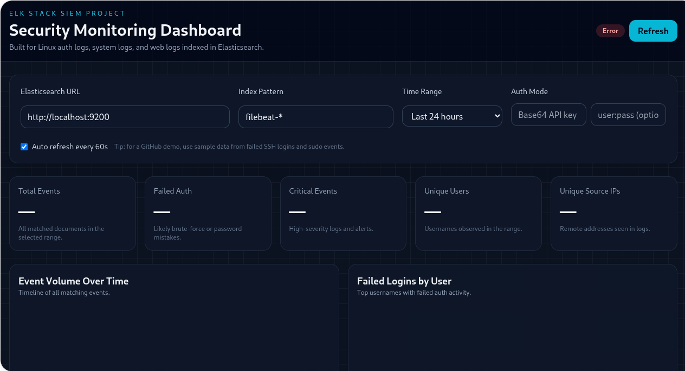
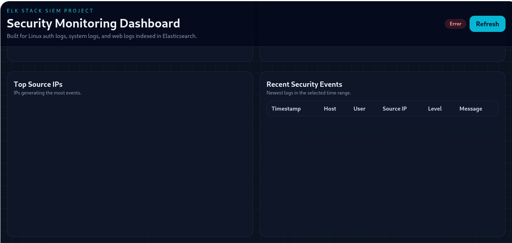

# 📊 SecureSIEM — ELK-Based Security Information & Event Management

> A self-hosted SIEM built on the Elastic Stack for log aggregation, correlation, and
> real-time security monitoring across multi-source environments.

## Overview

SecureSIEM demonstrates core SOC analyst workflows: collecting logs from diverse sources,
normalizing them into a common schema, correlating events to detect attack patterns, and
visualizing findings in analyst-ready dashboards.

## 💻Tech Stack

- Elasticsearch, Logstash, Kibana (ELK Stack)
- Filebeat / Winlogbeat for log shipping
- Docker Compose for orchestration
- Python scripts for custom log parsers

## ✨Core Features

- Ingest logs from Linux syslog, Windows Event Viewer, Apache/Nginx, and firewall sources
- Correlate events across sources (e.g., failed logins followed by a successful one)
- Pre-built Kibana dashboards for authentication events, network traffic, and anomalies
- Custom alert rules with threshold-based triggers
- Retention policies and index lifecycle management

## Dashboard

## Ingestion Sources

| Source              | Agent       | Log Types                          |
|---------------------|-------------|------------------------------------|
| Linux servers       | Filebeat    | auth.log, syslog, kern.log         |
| Windows endpoints   | Winlogbeat  | Security, System, Application      |
| Web servers         | Filebeat    | Apache/Nginx access & error logs   |
| Network devices     | Logstash    | Syslog UDP/TCP, firewall logs      |

## Included Dashboards

- 🔑 **Authentication Monitor** — login attempts, failures, privilege escalations
- 🌐 **Network Traffic Overview** — top talkers, port distribution, geo map
- ⚠️ **Threat Hunter** — IOC correlation, brute-force detection, beaconing
- 📋 **Compliance Summary** — failed controls, audit events

## Detection Rules

| Rule Name                      | Logic                                    | Severity |
|------------------------------- |------------------------------------------|----------|
| Brute Force Detected           | >5 failed logins in 60s from same IP     | High     |
| Successful Login After Fail    | Failed then success within 5 min         | Medium   |
| Privileged Command Executed    | sudo/su usage outside business hours     | Medium   |
| New Service Installed          | systemd new unit creation detected       | High     |

## 📄License

MIT License
